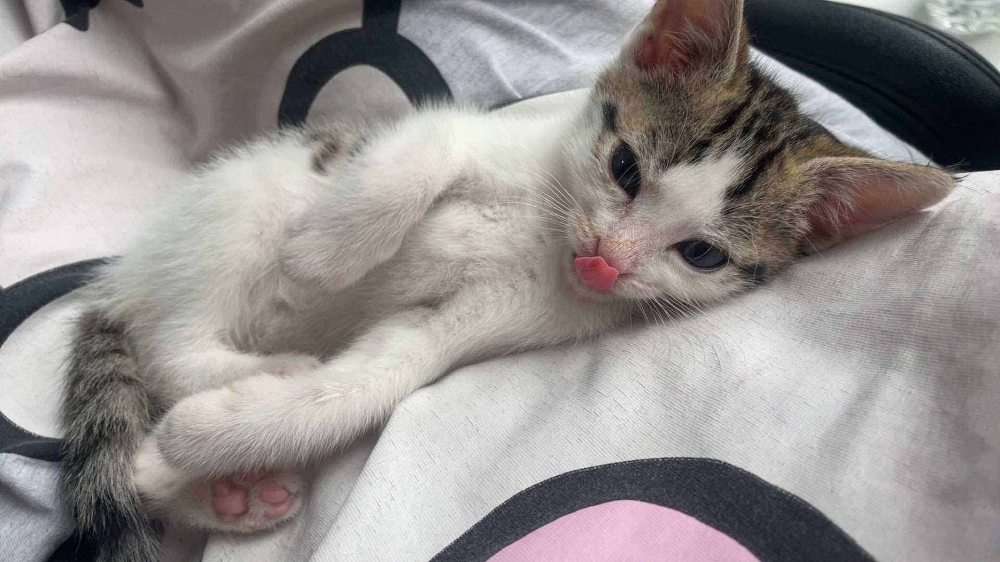

# 🚀 30 Days, 30 JavaScript Projects

The projects are taken from <a href="https://youtu.be/WoNmm4YS8e4" target="_blank">this video</a>.

The goal is to atleast make one project a day so that the challenge can be done in 30 days, but my focus will be to try to complete more than one a day if it seems easy, specially the beginner level projects. also this is a funny cat image:

  

## 🗂 Projects

| Day | Project |
|----|--------|
| 01 | Quiz Game (CLI) |
| 02 | Todo App |
| 03 | Calculator | 
| 04 | Number Guessing Game |

## 🧠 Goals
- Improve JavaScript fundamentals
- Build consistency
- Learn by building

## 📌 Tech Used
- JavaScript
- HTML & CSS
- Node.js (for CLI projects)
